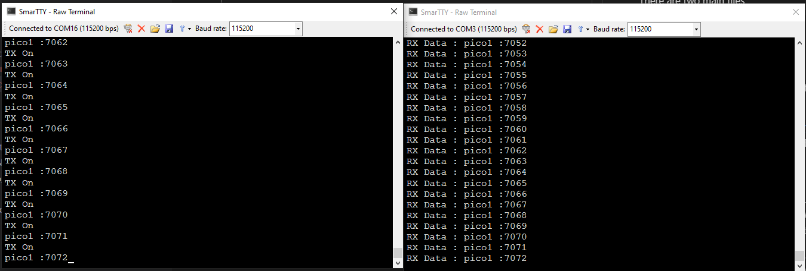

# Raspberry Pi Pico NRF24

## Project Layout

As long as the Pi Pico SDK is installed, you can download this repo and compile it

There are two main files
    
    nrf24_master.c: Transmitter
    nrf24_slave.c: Receiver

Each file will create its own binary that can be flased to the unit that acts as a transmitter or receiver.

Here is a sample output 

